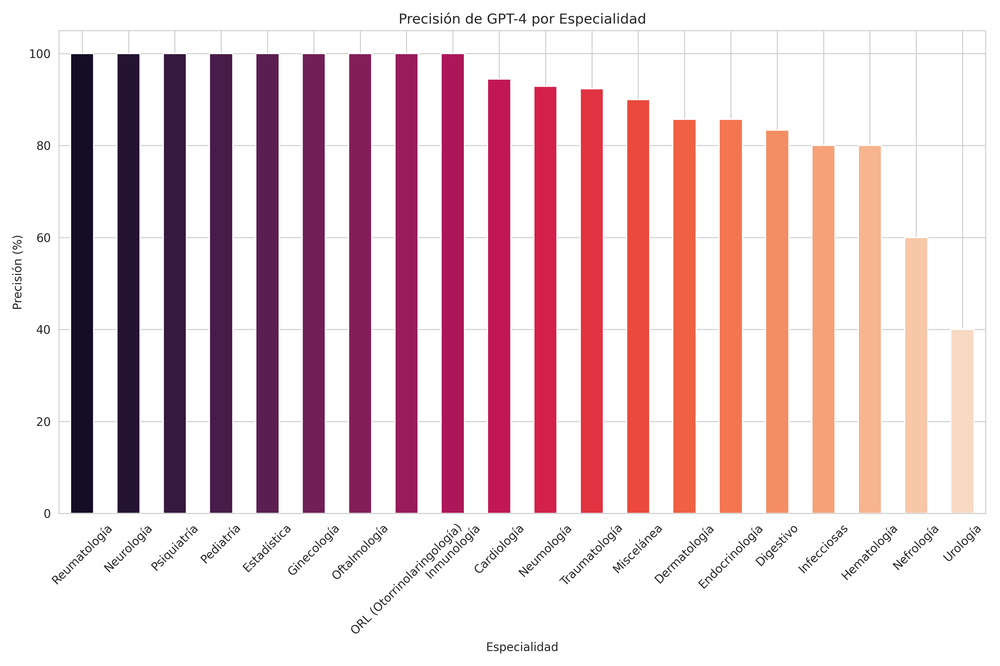
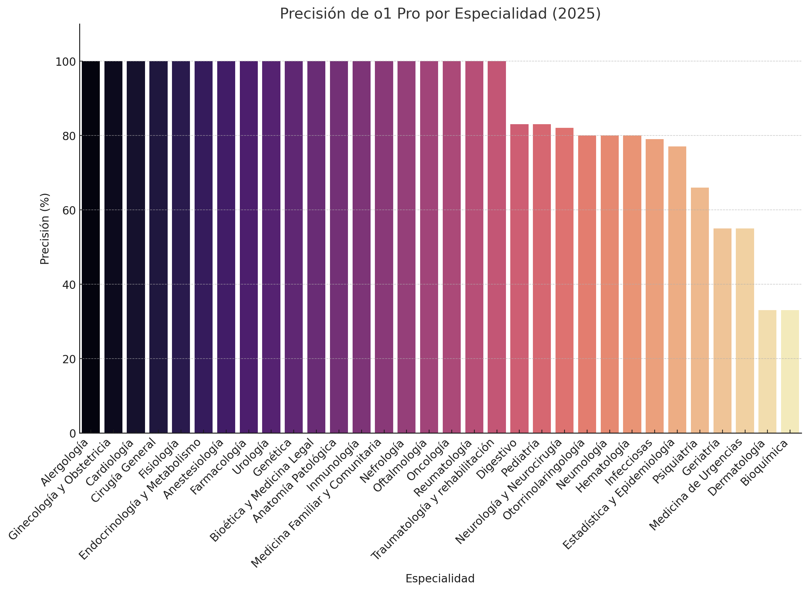
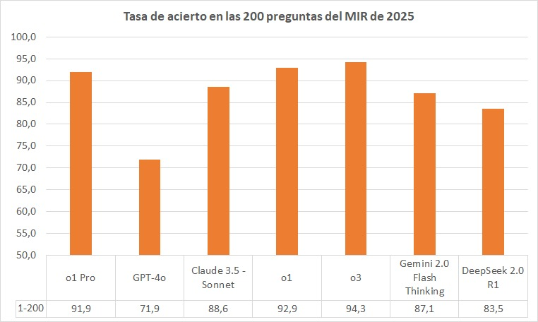

# Repositorio de Scripts y Datos del Examen MIR

Bienvenido a nuestro repositorio dedicado al Examen MIR. Esta colección contiene una serie de scripts y conjuntos de datos en Excel que se han utilizado para categorizar y responder a las preguntas del examen. Aprovechando las capacidades de Azure OpenAI GPT-4, hemos automatizado el proceso de comprensión y respuesta a los escenarios complejos presentados en el Examen MIR.

## Características

- **Categorización de Preguntas**: Scripts que utilizan algoritmos de IA avanzados para clasificar las preguntas del examen en categorías relevantes.
- **Respuestas Automatizadas**: Utilización de Azure OpenAI GPT-4 para generar respuestas precisas y contextualmente relevantes para las preguntas del Examen MIR.
- **Análisis de Imágenes**: Scripts que utilizan el modelo GPT-4 Vision para analizar y responder a preguntas basadas en imágenes.
- **Análisis de Datos**: Conjuntos de datos en Excel que contienen las preguntas y respuestas, junto con los insights analíticos derivados de los datos del examen.

## Resultados

### Examen MIR 2024 - Resultados con GPT-4

Nuestros scripts y conjuntos de datos han producido los siguientes resultados:

- Precisión general de GPT-4: 87.14% en 210 preguntas
- Error general de GPT-4: 12.86% en 210 preguntas


- Precisión de GPT-4 (sin imágenes): 90.27% en 185 preguntas sin imágenes
- Error de GPT-4 (sin imágenes): 9.73% en 185 preguntas sin imágenes


- Precisión de GPT-4 para imágenes (sin verlas): 64% en 25 preguntas sobre imágenes
- Error de GPT-4 para imágenes (sin verlas): 36% en 25 preguntas sobre imágenes


- Precisión de GPT-4 Vision: 76% en 25 preguntas sobre imágenes
- Error de GPT-4 Vision: 24% en 25 preguntas sobre imágenes

La precisión de GPT-4 por especialidad varía, con algunas especialidades alcanzando una precisión del 100%. 

Aquí adjuntamos dos gráficos, con y sin imágenes, que muestran la precisión de GPT-4 por especialidad.

### Gráficos de Precisión de GPT-4 (2024)



### Gráficos de Precisión de GPT-4 con imágenes (2024)


### Examen MIR 2025 - Resultados con o1 Pro

Para el examen MIR 2025, utilizamos distintos modelos y por ejemplo para el caso de o1 Pro obtuvimos los siguientes resultados generales:

- Aciertos: 183
- Fallos: 17
- En blanco: 0
- Aciertos netos: 177,33
- Puntuación total: 112,24

#### Precisión de o1 Pro por especialidad (2025)



### Comparativa de modelos de IA en el MIR 2025

Realizamos una comparativa entre diferentes modelos de IA para evaluar su rendimiento en las 200 preguntas del examen MIR 2025. Los resultados muestran que los modelos más avanzados como o3 (94,3%) y o1 (92,9%) obtuvieron las tasas de acierto más altas, seguidos por o1 Pro (91,9%) y Claude 3.5 Sonnet (88,6%). Esta comparativa demuestra el potencial de los modelos multimodales de última generación para asistir en la preparación y evaluación de exámenes médicos.



### Evolución de los modelos: Comparativa 2024 vs 2025

Al comparar los resultados obtenidos en los exámenes MIR de 2024 y 2025, observamos una mejora significativa en el rendimiento de los modelos de IA, especialmente en preguntas basadas en imágenes:

#### Mejora en preguntas con imágenes:
- **MIR 2024**: GPT-4 Vision logró una precisión del 76% en preguntas con imágenes
- **MIR 2025**: o1 Pro alcanzó una precisión del 92% en preguntas con imágenes (acertando 23 de 25)

Esta evolución demuestra el rápido avance de los modelos multimodales en apenas un año. Los modelos de 2025 muestran una capacidad notablemente superior para interpretar y analizar imágenes médicas, reduciendo significativamente la brecha entre su rendimiento en preguntas textuales y visuales.

La comparativa general también muestra un progreso en la precisión total:
- **MIR 2024**: GPT-4 logró una precisión general del 87,14%
- **MIR 2025**: Los mejores modelos (o3, o1) superaron el 92% de precisión

Estos resultados sugieren que los modelos de IA están alcanzando niveles cercanos al rendimiento profesional en pruebas médicas estandarizadas, lo que abre nuevas posibilidades para su uso como herramientas de apoyo en la educación y práctica médica.

## Empezando

Para empezar a utilizar estos scripts y conjuntos de datos, asegúrate de tener instalados los siguientes requisitos previos:

- Python 3.x
- Paquetes de Python requeridos: `langchain`, `langchain-openai`, `openai`, `python-dotenv`, `pandas`, `tqdm`, `openpyxl`, `matplotlib`, `seaborn`

Puedes instalar todos los paquetes requeridos utilizando el siguiente comando en tu terminal:

```bash
pip install -r requirements.txt
```

En el archivo ".env" debes reemplazar los valores de las variables con tus propias credenciales. Tienes un ejemplo en el archivo env.sample con las credenciales necesarias.

Asegúrate de estar en el directorio correcto cuando ejecutes este comando.