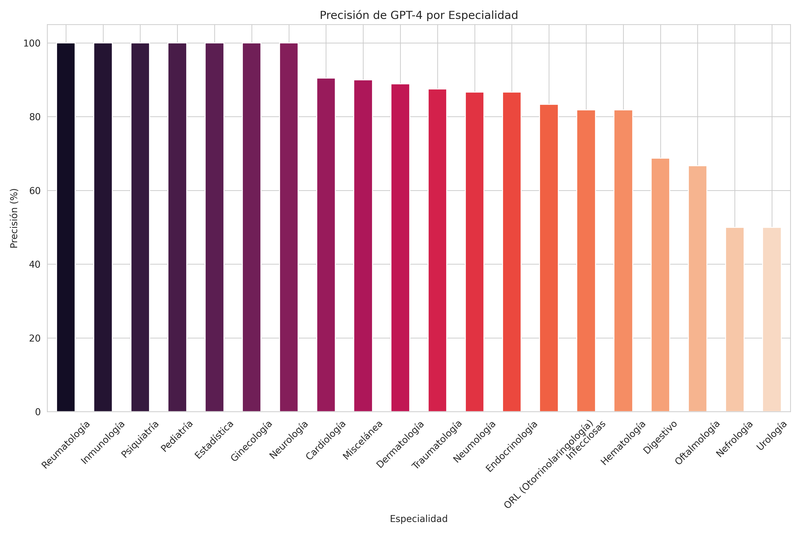

# Repositorio de Scripts y Datos del Examen MIR

Bienvenido a nuestro repositorio dedicado al Examen MIR. Esta colección contiene una serie de scripts y conjuntos de datos en Excel que se han utilizado para categorizar y responder a las preguntas del examen. Aprovechando las capacidades de Azure OpenAI GPT-4, hemos automatizado el proceso de comprensión y respuesta a los escenarios complejos presentados en el Examen MIR.

## Características

- **Categorización de Preguntas**: Scripts que utilizan algoritmos de IA avanzados para clasificar las preguntas del examen en categorías relevantes.
- **Respuestas Automatizadas**: Utilización de Azure OpenAI GPT-4 para generar respuestas precisas y contextualmente relevantes para las preguntas del Examen MIR.
- **Análisis de Imágenes**: Scripts que utilizan el modelo GPT-4 Vision para analizar y responder a preguntas basadas en imágenes.
- **Análisis de Datos**: Conjuntos de datos en Excel que contienen las preguntas y respuestas, junto con los insights analíticos derivados de los datos del examen.

## Resultados

### Examen MIR 2024 - Resultados con GPT-4

Nuestros scripts y conjuntos de datos han producido los siguientes resultados:

- Precisión general de GPT-4: 87.14% en 210 preguntas
- Error general de GPT-4: 12.86% en 210 preguntas


- Precisión de GPT-4 (sin imágenes): 90.27% en 185 preguntas sin imágenes
- Error de GPT-4 (sin imágenes): 9.73% en 185 preguntas sin imágenes


- Precisión de GPT-4 para imágenes (sin verlas): 64% en 25 preguntas sobre imágenes
- Error de GPT-4 para imágenes (sin verlas): 36% en 25 preguntas sobre imágenes


- Precisión de GPT-4 Vision: 76% en 25 preguntas sobre imágenes
- Error de GPT-4 Vision: 24% en 25 preguntas sobre imágenes

La precisión de GPT-4 por especialidad varía, con algunas especialidades alcanzando una precisión del 100%. 

Aquí adjuntamos dos gráficos, con y sin imágenes, que muestran la precisión de GPT-4 por especialidad.

### Gráficos de Precisión de GPT-4 (2024)


### Gráficos de Precisión de GPT-4 con imágenes (2024)




### Examen MIR 2025 - Resultados con o1 Pro

Para el examen MIR 2025, utilizamos distintos modelos y por ejemplo para el caso de o1 Pro obtuvimos los siguientes resultados generales:

- Aciertos: 183
- Fallos: 17
- En blanco: 0
- Aciertos netos: 177,33
- Puntuación total: 112,24

#### Precisión de o1 Pro por especialidad (2025)


### Comparativa de modelos de IA en el MIR 2025

Realizamos una comparativa entre diferentes modelos de IA para evaluar su rendimiento en las 200 preguntas del examen MIR 2025. Los resultados muestran que los modelos más avanzados como o3 (94,3%) y o1 (92,9%) obtuvieron las tasas de acierto más altas, seguidos por o1 Pro (91,9%) y Claude 3.5 Sonnet (88,6%). Esta comparativa demuestra el potencial de los modelos multimodales de última generación para asistir en la preparación y evaluación de exámenes médicos.


### Análisis de concurrencia entre modelos

Para profundizar en nuestro análisis, creamos un heatmap de concurrencia con dendrograma que muestra la similitud en las respuestas entre los diferentes modelos evaluados. Los valores más altos (en rojo) indican mayor coincidencia en las respuestas, mientras que los valores más bajos (en azul) indican mayor divergencia.


Este análisis revela patrones interesantes:

- Los modelos de OpenAI (o1 Pro y o1) muestran alta concordancia entre sí (0.93/0.82), formando un grupo claramente diferenciado
- GPT-4o muestra una baja correlación con o1 Pro y o1 (aproximadamente 0.20), lo que sugiere un enfoque diferente para resolver las preguntas
- Claude 3.5 Sonnet tiene mayor concordancia con GPT-4o (0.75) que con los modelos más nuevos de OpenAI
- Gemini 2 Flash Thinking tiene correlaciones moderadas con Claude 3.5 Sonnet (0.56) y GPT-4o (0.70)

Esta diversidad en las respuestas sugiere que diferentes modelos tienen distintas "fortalezas" y enfoques para resolver problemas médicos, lo que podría ser útil para crear sistemas de consenso que aprovechen las ventajas de cada modelo.


### Examen MIR 2026 - Resultados Multimodelo

Para el examen MIR 2026, realizamos una evaluación exhaustiva con 8 modelos de IA de última generación, incluyendo las nuevas versiones de GPT-5, Claude 4.5, Gemini 3 y DeepSeek.

#### Ranking Final MIR 2026

| Posición | Modelo | Precisión |
|----------|--------|-----------|
| 1 | **GPT-5.2** | 97.14% |
| 2 | **o3** | 95.71% |
| 3 | **GPT-5-mini** | 94.76% |
| 4 | **DeepSeek-R1** | 93.33% |
| 5 | **Gemini 3 Pro** | 92.38% |
| 6 | **Claude Opus 4.5** | 91.43% |
| 7 | **Claude Sonnet 4.5** | 90.95% |
| 8 | **DeepSeek V3.2** | 70.00% |

#### Comparativa de Modelos (2026)


#### Rendimiento en Preguntas con Imágenes vs Sin Imágenes

| Modelo | Con Imagen (25) | Sin Imagen (185) |
|--------|-----------------|------------------|
| GPT-5.2 | 96.0% | 97.3% |
| o3 | 92.0% | 96.2% |
| GPT-5-mini | 92.0% | 95.1% |
| DeepSeek-R1 | 88.0% | 94.1% |
| Gemini 3 Pro | 64.0% | 96.2% |
| Claude Opus 4.5 | 52.0% | 96.8% |
| Claude Sonnet 4.5 | 60.0% | 95.1% |
| DeepSeek V3.2 | 28.0% | 75.7% |

#### Precisión por Especialidad - GPT-5.2 (Mejor modelo)


#### Rendimiento en Preguntas con Imagen vs Sin Imagen


#### Concordancia entre Modelos

El heatmap muestra la proporción de respuestas coincidentes entre cada par de modelos:


#### Distribución de Preguntas por Especialidad


#### Observaciones Clave del MIR 2026

1. **GPT-5.2 lidera** con 97.14%, siendo el mejor tanto en preguntas con imagen (96%) como sin imagen (97.3%)
2. **DeepSeek-R1** (modelo de razonamiento) supera a modelos más establecidos como Gemini y Claude
3. **Gran disparidad en imágenes médicas**: GPT-5.2 (96%) vs DeepSeek V3.2 (28%)
4. **Claude Opus 4.5** tiene excelente rendimiento en texto (96.8%) pero el peor en imágenes (52%)
5. **3 preguntas falladas por TODOS los modelos** (3, 122, 139), posiblemente impugnables
6. **Cardiología** es la especialidad con más preguntas (21), seguida de Digestivo (17) y Ginecología (15)

---

### Evolución de los modelos: Comparativa 2024 vs 2025 vs 2026

Al comparar los resultados obtenidos en los exámenes MIR de 2024, 2025 y 2026, observamos una mejora continua en el rendimiento de los modelos de IA:

#### Evolución de la precisión máxima:
- **MIR 2024**: GPT-4 logró 87.14%
- **MIR 2025**: o3 alcanzó 94.3%
- **MIR 2026**: GPT-5.2 alcanzó **97.14%**

#### Mejora en preguntas con imágenes:
- **MIR 2024**: GPT-4 Vision logró una precisión del 76% en preguntas con imágenes
- **MIR 2025**: o1 Pro alcanzó una precisión del 92% en preguntas con imágenes
- **MIR 2026**: GPT-5.2 alcanzó **96%** en preguntas con imágenes

Esta evolución demuestra el rápido avance de los modelos multimodales. En solo dos años, la precisión general ha pasado del 87% al 97%, y la precisión en imágenes médicas del 76% al 96%.

#### Comparativa histórica

| Año | Mejor Modelo | Precisión General | Precisión Imágenes |
|-----|--------------|-------------------|-------------------|
| 2024 | GPT-4 | 87.14% | 76% |
| 2025 | o3 | 94.3% | 92% |
| 2026 | GPT-5.2 | **97.14%** | **96%** |

Estos resultados confirman que los modelos de IA están alcanzando niveles de excelencia en pruebas médicas estandarizadas, superando consistentemente el umbral del 90% que típicamente se considera "nivel experto".

## Empezando

Para empezar a utilizar estos scripts y conjuntos de datos, asegúrate de tener instalados los siguientes requisitos previos:

- Python 3.x
- Paquetes de Python requeridos: `langchain`, `langchain-openai`, `openai`, `python-dotenv`, `pandas`, `tqdm`, `openpyxl`, `matplotlib`, `seaborn`

Puedes instalar todos los paquetes requeridos utilizando el siguiente comando en tu terminal:

```bash
pip install -r requirements.txt
```

En el archivo ".env" debes reemplazar los valores de las variables con tus propias credenciales. Tienes un ejemplo en el archivo env.sample con las credenciales necesarias.

Asegúrate de estar en el directorio correcto cuando ejecutes este comando.