# MIR 2026 - Resultados de Evaluación

Fecha: 3/2/2026, 17:50:30

## Resultados por Modelo

| Modelo | Aciertos | Total | % Acierto | Errores |
|--------|----------|-------|-----------|--------|
| gpt5mini | 203 | 210 | 96.67% | 0 |
| o3 | 204 | 210 | 97.14% | 0 |
| gemini3pro | 193 | 210 | 91.90% | 0 |
| claude45sonnet | 193 | 210 | 91.90% | 0 |
| claude45opus | 191 | 210 | 90.95% | 0 |
| gpt52 | 204 | 210 | 97.14% | 0 |
| deepseek | 147 | 210 | 70.00% | 0 |
| deepseekr1 | 198 | 210 | 94.29% | 0 |
| OpenEvidence | 203 | 210 | 96.67% | 0 |

## Ranking

1. **o3**: 97.14% (204/210)
2. **gpt52**: 97.14% (204/210)
3. **gpt5mini**: 96.67% (203/210)
4. **OpenEvidence**: 96.67% (203/210)
5. **deepseekr1**: 94.29% (198/210)
6. **gemini3pro**: 91.9% (193/210)
7. **claude45sonnet**: 91.9% (193/210)
8. **claude45opus**: 90.95% (191/210)
9. **deepseek**: 70% (147/210)

## Desglose por Tipo de Pregunta

| Modelo | Con Imagen | Sin Imagen |
|--------|------------|------------|
| gpt5mini | 203/210 (96.7%) | 0/0 (0.0%) |
| o3 | 204/210 (97.1%) | 0/0 (0.0%) |
| gemini3pro | 193/210 (91.9%) | 0/0 (0.0%) |
| claude45sonnet | 193/210 (91.9%) | 0/0 (0.0%) |
| claude45opus | 191/210 (91.0%) | 0/0 (0.0%) |
| gpt52 | 204/210 (97.1%) | 0/0 (0.0%) |
| deepseek | 147/210 (70.0%) | 0/0 (0.0%) |
| deepseekr1 | 198/210 (94.3%) | 0/0 (0.0%) |
| OpenEvidence | 203/210 (96.7%) | 0/0 (0.0%) |

## Preguntas Falladas por Modelo

- **gpt5mini** (7): 1, 3, 77, 128, 197, 198, 208
- **o3** (6): 3, 14, 77, 197, 198, 208
- **gemini3pro** (17): 3, 5, 6, 9, 11, 16, 18, 20, 25, 77, 111, 132, 138, 140, 172, 197, 208
- **claude45sonnet** (17): 3, 6, 7, 9, 10, 11, 13, 14, 20, 22, 77, 132, 140, 172, 197, 198, 208
- **claude45opus** (19): 3, 4, 6, 9, 10, 11, 12, 13, 14, 18, 22, 24, 77, 111, 127, 132, 138, 140, 197
- **gpt52** (6): 3, 77, 132, 142, 197, 208
- **deepseek** (63): 1, 3, 5, 6, 7, 8, 9, 11, 12, 13, 15, 16, 18, 19, 20, 21, 23, 24, 27, 31, 33, 36, 38, 50, 56, 58, 64, 66, 71, 73, 77, 81, 82, 91, 109, 110, 116, 118, 119, 120, 123, 124, 132, 134, 138, 140, 142, 143, 155, 156, 163, 169, 172, 176, 179, 188, 190, 192, 197, 198, 202, 207, 208
- **deepseekr1** (12): 1, 3, 11, 66, 77, 82, 128, 132, 140, 172, 197, 198
- **OpenEvidence** (7): 11, 20, 64, 77, 172, 197, 208

## Preguntas Falladas por TODOS los Modelos

77, 197

---

## Gráficas

### Comparativa de Modelos

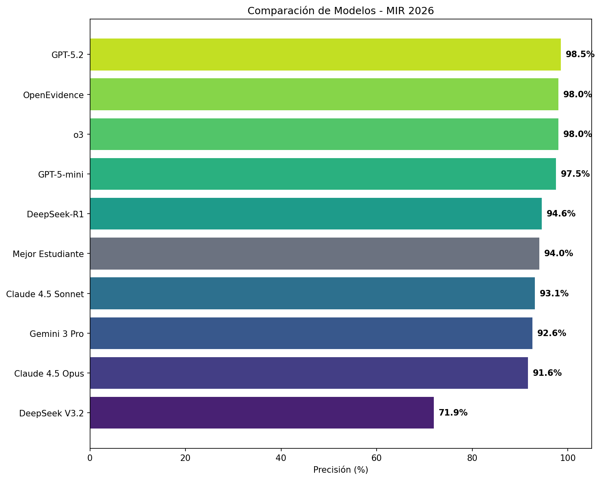

### Rendimiento: Con Imagen vs Sin Imagen

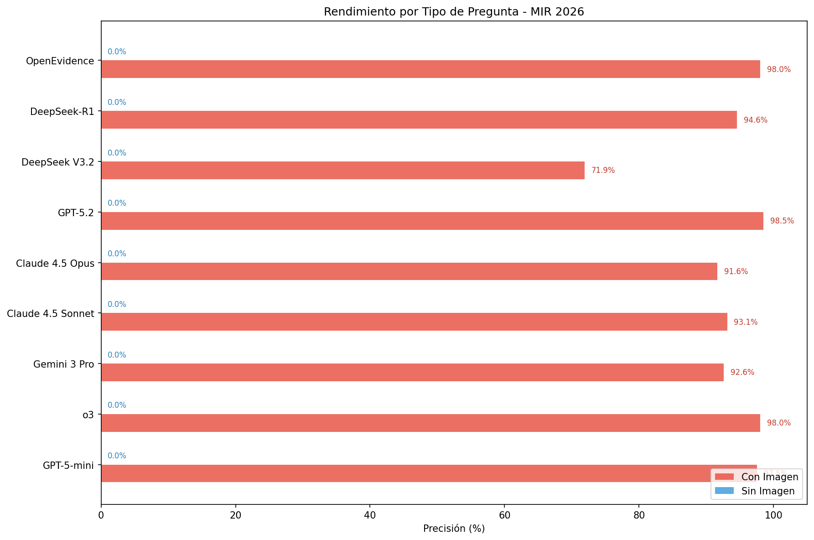

### Concordancia entre Modelos

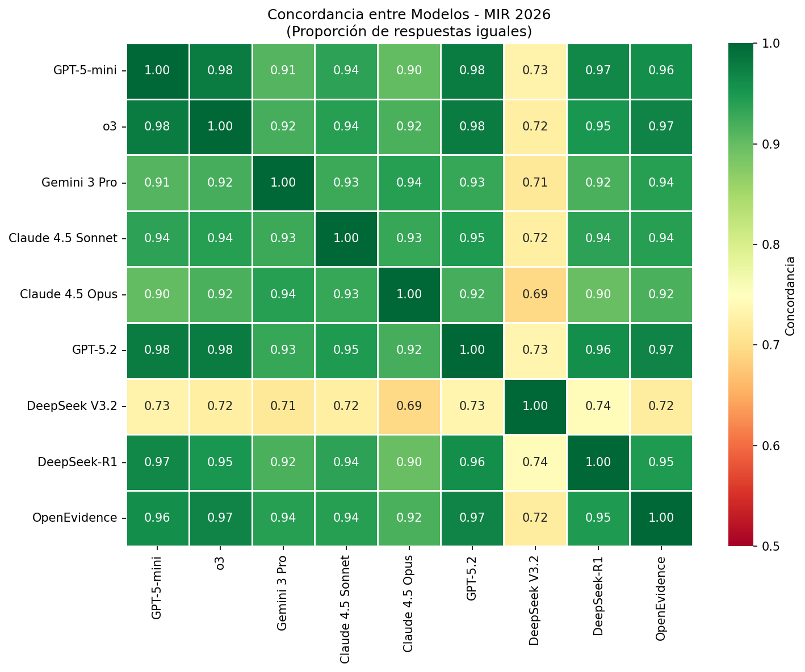

### Distribución de Preguntas por Especialidad

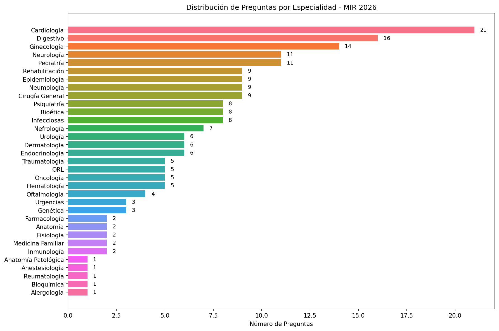

---

### Precisión por Especialidad - Por Modelo

#### o3

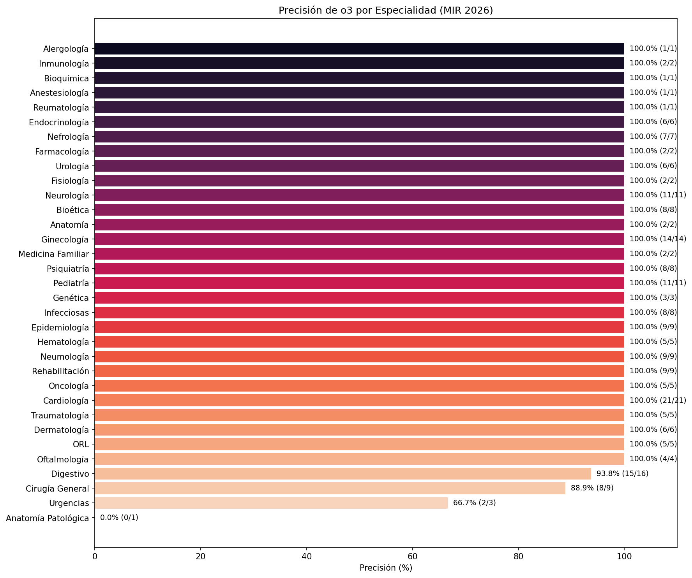

#### GPT-5.2

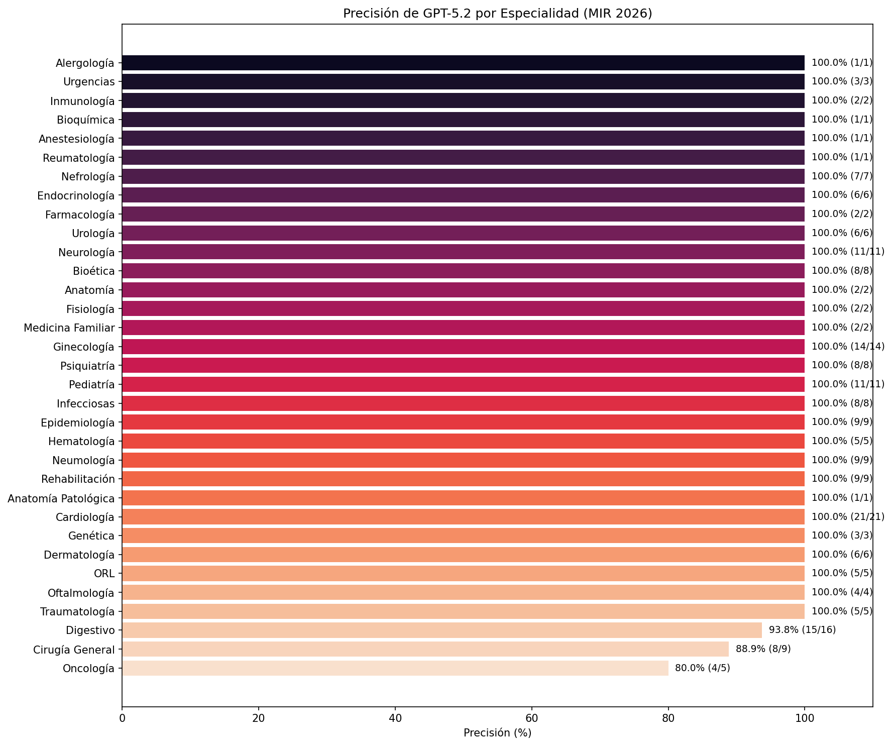

#### GPT-5-mini

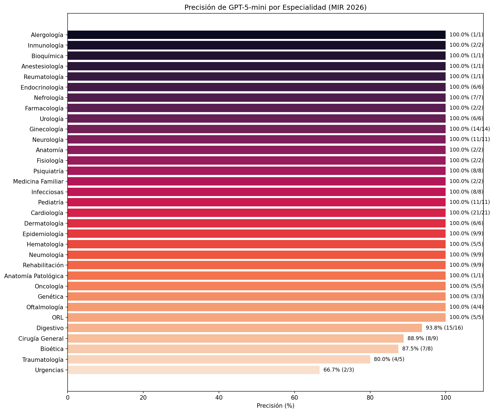

#### DeepSeek-R1

#### Gemini 3 Pro

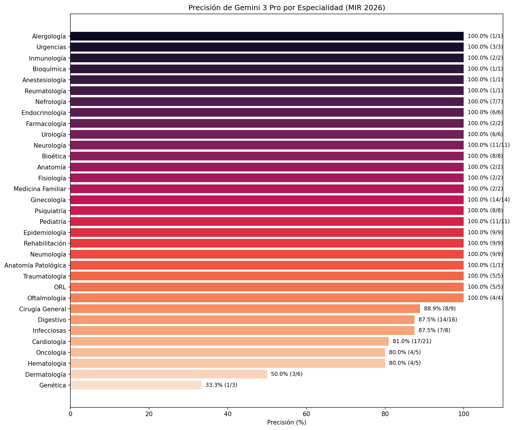

#### Claude 4.5 Sonnet

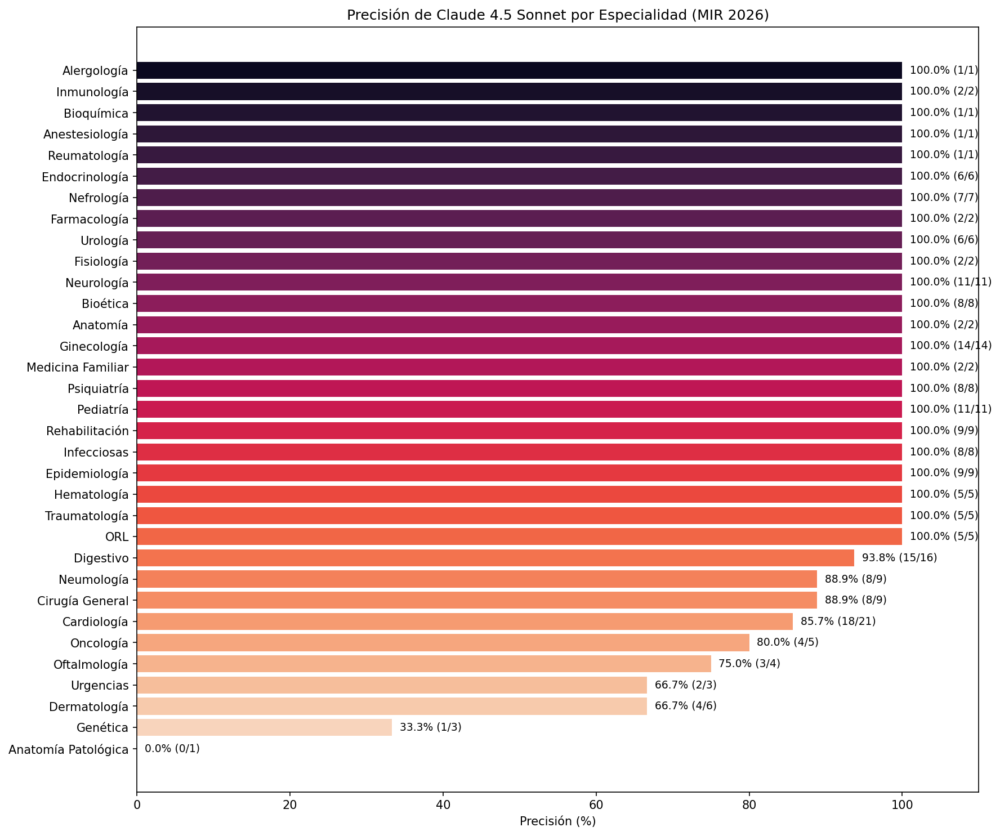

#### Claude 4.5 Opus

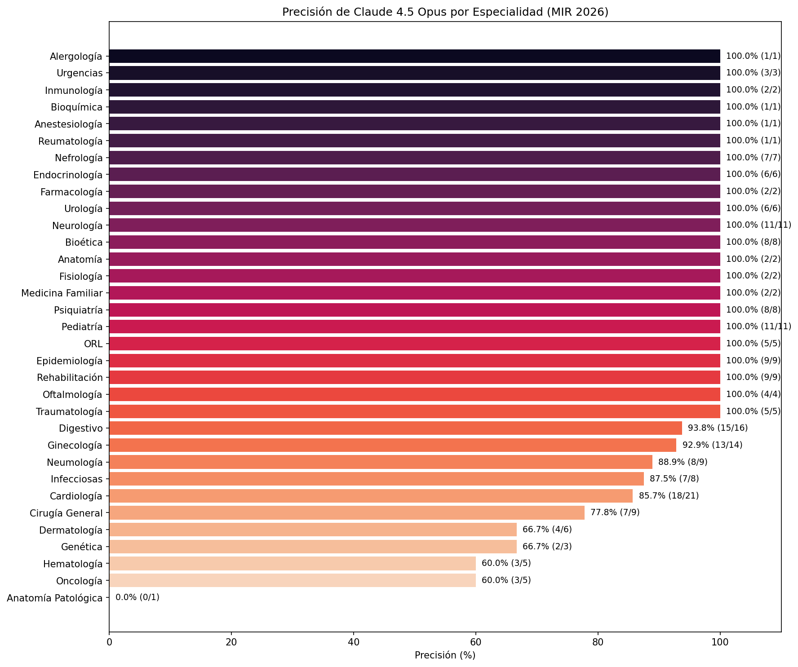

#### DeepSeek V3.2

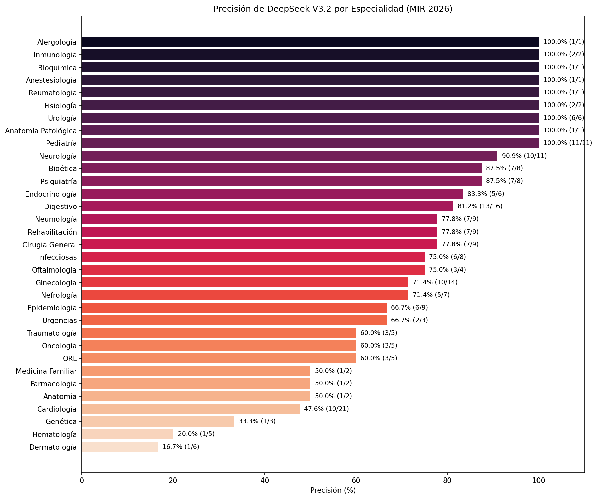

#### OpenEvidence

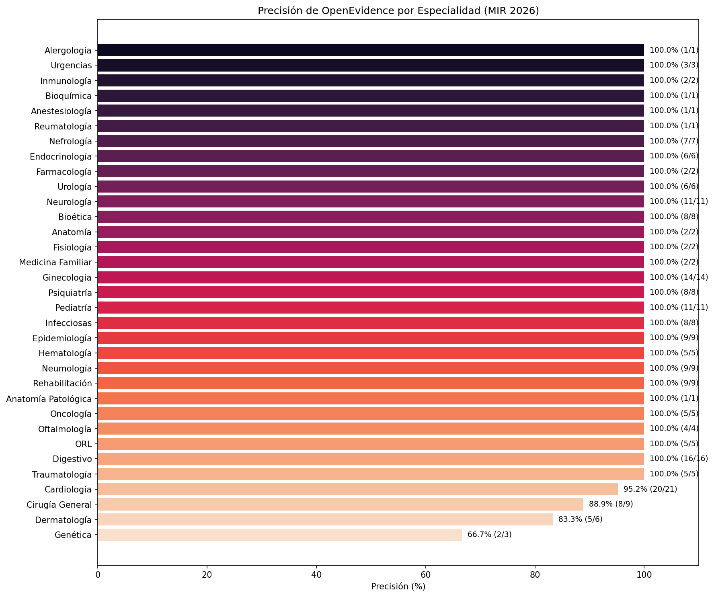

